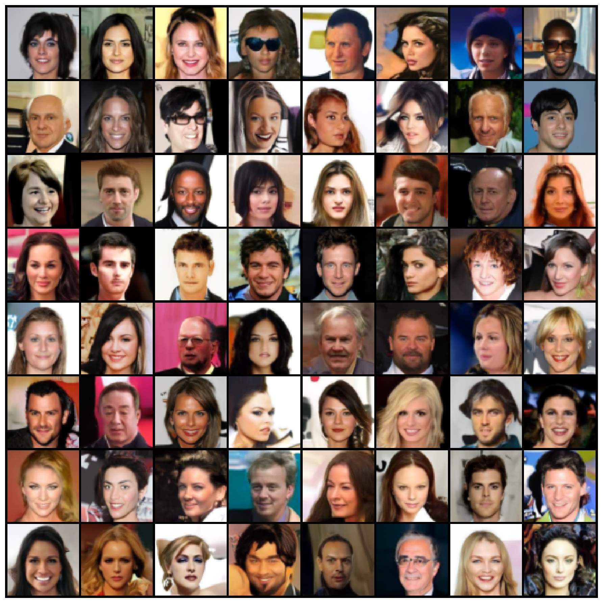
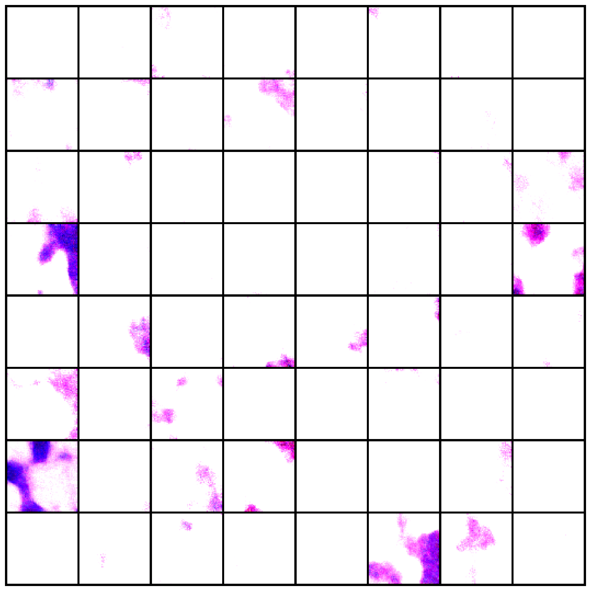
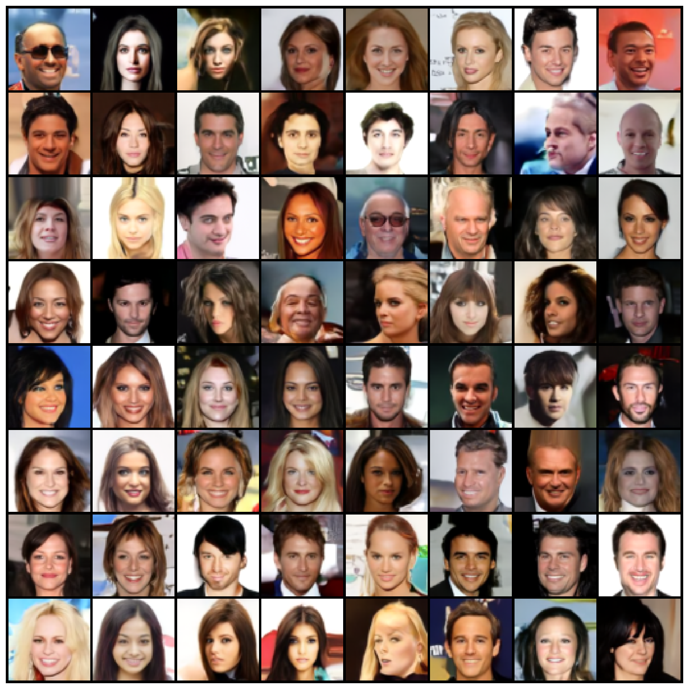
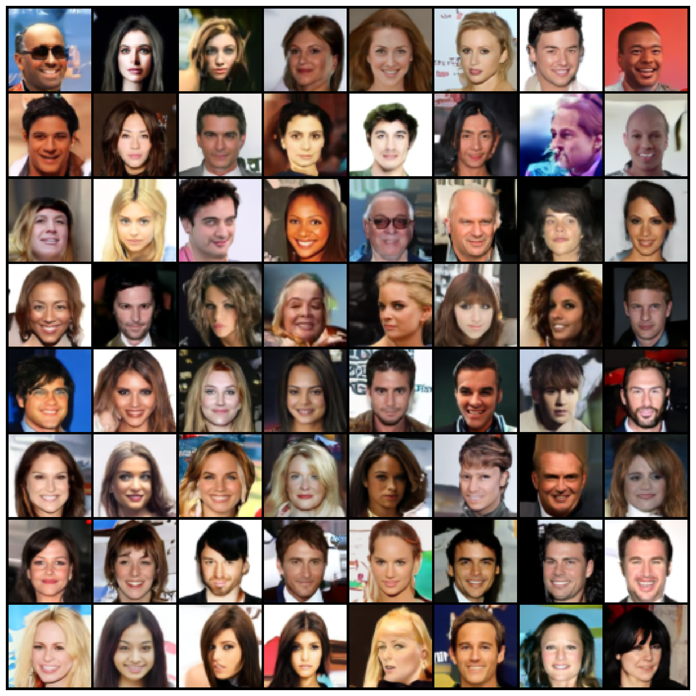
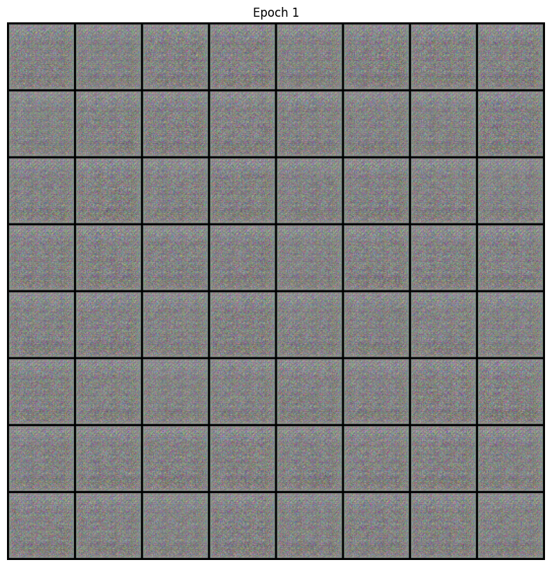
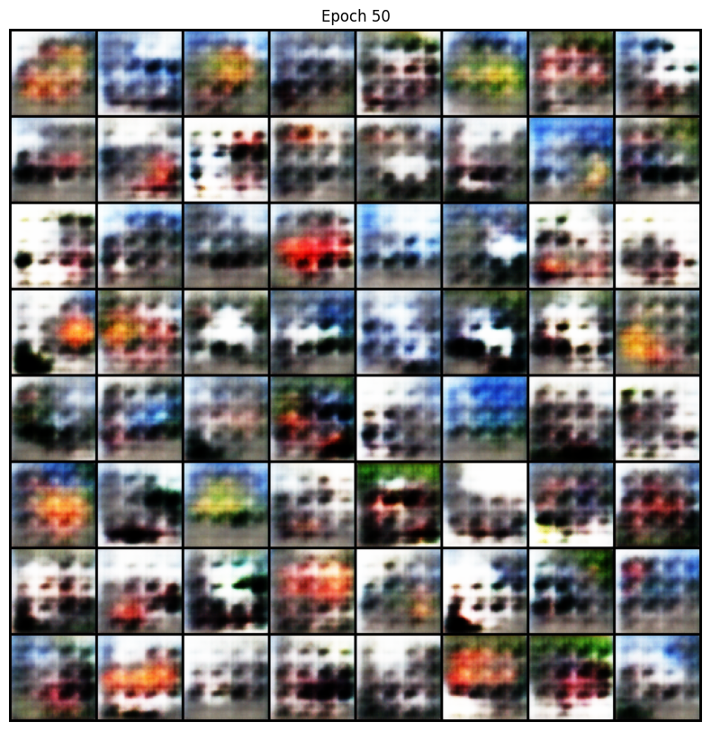
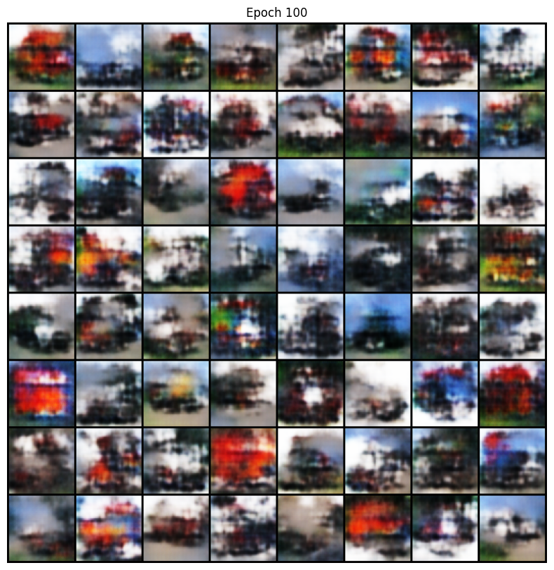

# DDPM Image Generation with CelebA

[](https://www.python.org/)
[](https://pytorch.org/)
[](LICENSE)
[](https://developer.apple.com/metal/pytorch/)

Implementation of **Denoising Diffusion Probabilistic Models (DDPM)** for generating realistic human face images using the CelebA dataset.

Trained from scratch on Apple Silicon (MPS) for ~60 hours, reaching a best loss of **0.01564** at epoch 33.

---

## Final Result

<p align="center">
  
</p>

64 generated face images at 64×64 resolution using EMA model weights.

## Training Progression

| Epoch 5 | Epoch 25 | Epoch 50 | Epoch 60 |
|:---:|:---:|:---:|:---:|
|  |  |  |  |
| Color blobs | Faces emerge | Clear details | Final result |

## DDPM vs DCGAN

For comparison, I also trained a DCGAN on the same dataset. DDPM produces visibly more diverse and stable results.

| | Early | Mid | Late |
|---|:---:|:---:|:---:|
| **DCGAN** |  |  |  |
| **DDPM** |  |  |  |

See the full write-up: [DDPM Image Generation Research (PDF)](report/DDPM_Image_Generation_Research.pdf)

---

## Model Architecture

- **Architecture**: U-Net with self-attention
- **Parameters**: 22,199,683 (~22M)
- **Dataset**: CelebA (162,770 images)
- **Resolution**: 64 × 64
- **Timesteps**: 1000 (linear beta schedule)

## Training Configuration

| Parameter | Value |
|---|---|
| Batch Size | 64 |
| Learning Rate | 2e-4 (Adam) |
| Epochs | 60 |
| Beta Schedule | Linear (1e-4 → 0.02) |
| Model Channels | 128 |
| Channel Multipliers | (1, 2, 2, 2) |
| Attention Resolution | 16 × 16 |
| Residual Blocks | 2 per level |
| Dropout | 0.1 |
| EMA Decay | 0.9999 |
| Device | Apple MPS |
| Total Training Time | ~60 hours |

## Project Structure

```
DDPM/
├── config.py              # Training configuration
├── train.py               # Training script
├── sample.py              # Image generation script
├── requirements.txt       # Python dependencies
├── models/
│   ├── unet.py            # U-Net architecture
│   └── diffusion.py       # Diffusion process
├── data/
│   └── dataset.py         # CelebA / CIFAR-10 loader
├── utils/
│   ├── checkpointing.py
│   └── visualization.py
├── outputs_ddpm/
│   └── samples/           # Generated samples per epoch
└── report/
    ├── DDPM_Image_Generation_Research.pdf
    ├── DDPM_Research_Report.html
    └── GAN_vs_DDPM_Report.html
```

## Quickstart

```bash
git clone https://github.com/lucasking0109/DDPM_w-CelebA_Data.git
cd DDPM_w-CelebA_Data
pip install -r requirements.txt
python train.py
```

The CelebA dataset will be downloaded automatically into `./data_cache` on first run.
To use a different location, set `DDPM_DATA_DIR=/path/to/data`.

### Resume training
```bash
python train.py --resume outputs_ddpm/checkpoints/best_model.pth
```

### Generate samples
```bash
python sample.py --checkpoint outputs_ddpm/checkpoints/best_model.pth
```

## Key Findings

- **Training stability**: DDPM trained smoothly with no mode collapse, unlike the DCGAN baseline.
- **Best loss**: 0.01564 at epoch 33.
- **Image quality**: Clear facial features with diverse hairstyles, skin tones, and backgrounds.
- **Cost of quality**: DDPM sampling is ~1000× slower than GAN inference (1000 denoising steps vs single forward pass).

## Reports

- [Full PDF Report](report/DDPM_Image_Generation_Research.pdf)
- [DDPM Research Report (HTML)](report/DDPM_Research_Report.html)
- [GAN vs DDPM Comparison (HTML)](report/GAN_vs_DDPM_Report.html)

## References

- Ho et al., *Denoising Diffusion Probabilistic Models*, NeurIPS 2020 — [arXiv:2006.11239](https://arxiv.org/abs/2006.11239)
- Liu et al., *Deep Learning Face Attributes in the Wild* (CelebA dataset), ICCV 2015

## License

[MIT](LICENSE)
